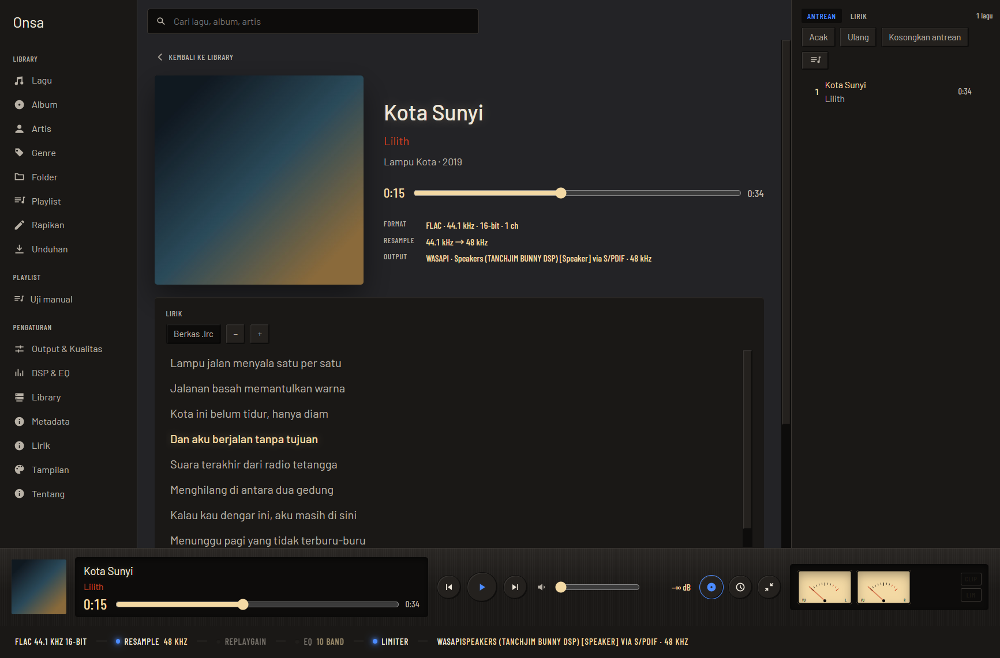

# Onsa

Onsa (音叉, garpu tala) adalah pemutar musik desktop untuk Windows dan Linux, dibangun dengan Tauri 2, Rust, dan SvelteKit. Ia untuk orang yang menyimpan berkas musiknya sendiri dan ingin tahu apa yang sebenarnya terjadi pada suaranya: tampilannya panel instrumen, dan strip di bawah jendela menunjukkan rantai yang benar-benar dilewati sinyal — format sumber, resample, ReplayGain, EQ, limiter, sampai backend output. Tidak ada yang tersembunyi dan tidak ada yang menghubungi internet kecuali kamu menyalakannya.



## Yang ada di v1

- **Pemutaran**: gapless, crossfade, antrean yang bisa diurut ulang, playlist manual dan playlist pintar, sleep timer, mini player.
- **Rantai DSP yang terlihat**: ReplayGain, EQ sepuluh band atau parametrik (bisa mengimpor preset AutoEQ), limiter, meter puncak, spektrum. Tiap tahap bisa dimatikan dari strip jalur sinyal.
- **Library**: memindai folder, mengikuti perubahannya, pencarian teks penuh, penjelajahan per album, artis, genre, dan folder.
- **Metadata**: editor tag satu lagu dan massal. Editan disimpan di Onsa dulu; "tulis ke berkas" aksi terpisah, dan tiap jalannya bisa dibatalkan. Ada rename berpola dengan pratinjau, perapihan otomatis tanpa jaringan, dan — bila dinyalakan — pencarian ke AcoustID, MusicBrainz, dan Cover Art Archive yang hasilnya selalu berupa usulan.
- **Lirik**: berkas `.lrc` di sebelah lagu, lirik di dalam tag, atau LRCLIB. Baris yang sedang dinyanyikan menyala, klik baris untuk melompat ke sana, dan geseran waktu disimpan per lagu.
- **Unduhan**: satu URL pada satu waktu lewat yt-dlp, yang diambil hanya setelah kamu menyetujui sumbernya dan dicocokkan dengan checksum yang diterbitkan rilisnya.
- **Enam tema bawaan** (tiga gelap, tiga terang). Tema adalah berkas JSON: salin tema yang sedang dipakai dari Pengaturan → Tampilan sebagai titik mulai, ubah warnanya, buka Onsa lagi, dan tema itu muncul di daftar. Berkas tema yang tidak terbaca disebutkan di halaman yang sama, dengan alasannya.
- **Bantuan di dalam aplikasi**: tanda tanya di sudut yang sama pada tiap halaman, membuka penjelasan halaman itu beserta tiap kontrolnya, dan satu halaman Bantuan untuk hal yang tidak menempel di satu halaman.
- **Dua bahasa**, Indonesia dan Inggris. Semua fitur internet mati secara bawaan dan bisa dimatikan kapan saja.

## Lingkup v1, apa adanya

- **ffmpeg opsional.** Tanpa ffmpeg unduhan tetap berjalan: audionya diambil apa adanya, tanpa tag dan sampul tertanam, dan konversi ke MP3 atau FLAC tidak tersedia. Halaman Unduhan mengatakan itu di tempat pilihannya dibuat.
- **Sumber yang hanya menyediakan Opus ditolak**, dengan pesan, karena Onsa belum punya decoder Opus. Lebih baik ditolak di muka daripada berkasnya mendarat lalu tidak pernah muncul di library.
- **Folder library belum bisa dihapus** dari Pengaturan; yang ada baru menambah dan memindai ulang.
- **fpcalc dipasang sendiri.** Pengenalan lagu lewat suaranya butuh fpcalc dari Chromaprint, dan Onsa belum bisa mengunduhnya sendiri: ada tombol yang membuka halaman rilis resminya, dan sesudah dipasang, tunjukkan berkasnya lewat "Cari fpcalc…" di Pengaturan → Metadata. Pencarian lewat judul dan artis tetap jalan tanpa fpcalc.
- **Belum ada scrobble Last.fm.**

Yang sudah terbit sesudah v1: **v1.1** bantuan di dalam aplikasi, dan **v1.2** paket untuk
tester beserta berkas pemasang Windows yang dibangun CI. Garis berikutnya ada di
[`docs/SPEC.md`](docs/SPEC.md) §15 dan [`docs/PROGRESS.md`](docs/PROGRESS.md): v1.3 "Rapi"
(pengelolaan folder sumber, panel Sedang diputar), v1.4 "Unduhan penuh" (Deno dan ffmpeg,
antrean paralel, unduhan otomatis fpcalc, paket Linux), v1.5 "Tampilan", v1.6
"Lirik & metadata", v1.7 "Video".

## Membangun dan menjalankan

Semua sistem: Rust stable (dengan `rustfmt` dan `clippy`) dan Node.js 24 atau lebih baru.

Windows 10/11: Microsoft C++ Build Tools (workload "Desktop development with C++") dan WebView2 Runtime, yang sudah ada di Windows 11.

Linux (nama paket Debian/Ubuntu):

```sh
sudo apt install build-essential curl wget file pkg-config libssl-dev \
  libwebkit2gtk-4.1-dev libxdo-dev libayatana-appindicator3-dev librsvg2-dev \
  libasound2-dev
```

`libasound2-dev` dipakai output audio; di sistem PipeWire atau PulseAudio, suaranya lewat lapisan kompatibilitas ALSA mereka.

```sh
npm ci --prefix ui                       # sekali saja
npx --prefix ui tauri dev                # jalankan
npx --prefix ui tauri build --no-bundle  # satu berkas di target/release/
```

Berkas hasilnya berjalan tanpa dipasang dan tanpa toolchain apa pun di mesin itu. `ONSA_LOG=debug` menaikkan tingkat log. Mesin audionya juga bisa dijalankan tanpa antarmuka lewat `cargo run -p onsa-cli -- --help`.

## Cara kerja proyek ini

Spesifikasinya ditulis lebih dulu, sebelum baris kode pertama; pekerjaannya dibagi menjadi milestone yang dikerjakan berurutan; dan setiap keputusan yang tidak jelas dari kode dicatat beserta alasannya.

- [`docs/SPEC.md`](docs/SPEC.md) — spesifikasi lengkap: arsitektur, keputusan yang terkunci, dan milestone.
- [`docs/PROGRESS.md`](docs/PROGRESS.md) — apa yang selesai di tiap milestone, bagaimana diverifikasi, dan apa yang tertunda.
- [`docs/DECISIONS.md`](docs/DECISIONS.md) — keputusan yang diambil di sepanjang jalan, dengan alasannya.
